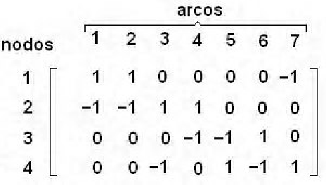

# Grafos
Sávio Rodrigues
---
# Introdução
A proposta do trabalho de Algoritmo e Estrutura de Dados II foi a representação de uma estrutura mínima de um grafo, a paritr dos conceitos apresentados na aula 7, sendo eles __Lista de Adjacencia__, __Matriz de Adjacencia__ e __Matriz de Incidência__.
# Apresentação
A teoria dos grafos ( ramo da matemática que estuda as relações entre os objetos de um determinado conjunto) é um assunto antigo, porém com várias aplicações no nosso dia-a-dia. No século XVIII o matématico suiço Leonard Euler utilizou os grafos para resolver o problemas que conhecemos como __As Sete pontes de königsberg__. 
<br><br>
A imagem a seguir possui uma representação de grafo, onde os números representam os vértices (V = {0, 1, 2}) e as letras representam as arestas (A = {a, b ,c}).
<p align="center">
    
</p>

# Código
A seguir, têm-se o o código com as _structs_ das três estruturas propostas com a inclusão da biblioteca _Lista.h_ , a qual foi produzida em Algoritmo e Estrutura de Dados I. 

```C
#ifndef _GRAFOS_
#define _GRAFOS_
#include "Lista.h"


//LISTA DE ADIJACÊNCIA
typedef struct grafoLA {
  int V;       //Vértices 
  Lista *L;    //Lista de adjacencia
}*GrafoLA;

//MATRIZ DE INCIDÊNCIA
typedef struct grafoMI{
   int V;   //Vertices
   int A;   //Arestas
   int **mat;
}*GrafoMI;

//MATRIZ DE ADJACÊNCIA
typedef struct grafoMA{ 
   int V;      //Vertices
   int A;      //Arestas
   int **mat; 
}*GrafoMA;


#endif
```
# Lista de Adjacência
Em literatura a lista de adjacência é uma representação, com todas as arestas ou arcos de um grafo em uma lista.
Portanto possui os seguintes atributos:
* __int V__ = Número de vértices
* __Lista *L__ = Número de Arestas
  
O tipo __Lista__ foi importado da biblioteca _Lista.h_ simplesmente encadeada a qual possui funções de inserção,remoção e impressão de elementos.  
A seguir tem-se a representação visual da lista de adjacência:
<p align="center">
    
</p>

# Matriz de Adjacência
A Matriz de Adjacêcia possui sua representação de grafo através de uma matriz bidimencional _n x n_.Portanto possui os seguintes atributos:
* __int V__ = Número de vértices
* __int A__ = Número de Arestas
* __int **mat__ = Matriz de incidencia.

 A seguir tem-se a representação visual dessa matriz:
<p align="center">
    
</p>

# Matriz de Incidência
Semelhante à matriz de adjacência, a de incidência possui uma representação de grafo através de uma matriz bidimencional. Porém uma das dimensões são arestas a outra são os vértices, ou seja uma matriz _n x m_. Portanto possui os seguintes atributos:
* __int V__ = Número de vértices
* __int A__ = Número de Arestas
* __int **mat__ = Matriz de incidencia.

A seguir tem-se a representação visual dessa matriz:
<p align="center">
    
</p>

Pode-se analisar que a matriz de incidencia possui o número -1, significando que o grafo é orientado e que o arco está chegando no vértice em questão.
# Referencias
https://www.ime.usp.br/~pf/algoritmos_para_grafos/aulas/graphdatastructs.html
https://pt.wikipedia.org/wiki/Matriz_de_incid%C3%AAncia
https://pt.wikipedia.org/wiki/Matriz_de_adjac%C3%AAncia